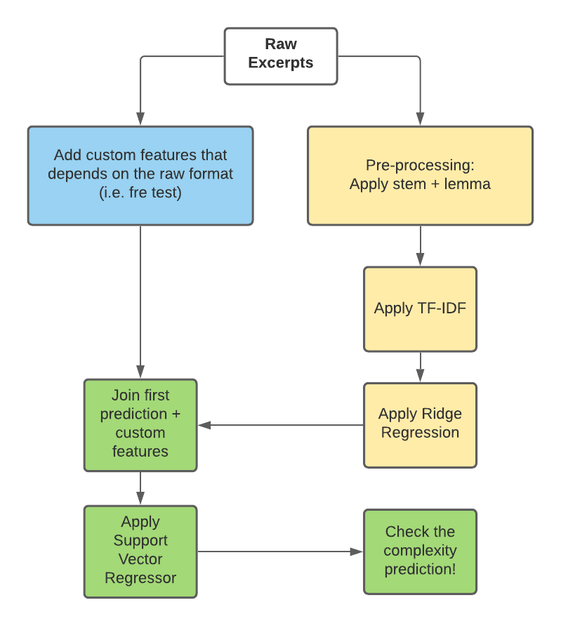

# commonlit readability challenge

My Attempt on this Kaggle competition, I'm using that dataset for my Udacity ND.
Here you can find an explanation on the problem, and how I solve it in a couple of weeks as best as I could.

&nbsp;

## Table of contents
- [*How to use this repository*](##How-to-use-this-repository)
- [*Domain Background*](##Domain-Background)
- [*Problem Statement*](##Problem-Statement)
- [*Dataset and Inputs*](##build-your-website-in-3-steps)
- [Solution Statement](##Solution-Statement)
- [Benchmark Model](##Benchmark-Model)
- [Evaluation Metrics](##Evaluation-Metrics)
- [Project Design](##Project-Design)
- [Results](##Results)
- [License](###License)

&nbsp;

## How to use this repository

If you want to understand my end-to-end approach please read the notebooks in this order:
- tools.py (optimonal to read, it includes the custom feature functions)
- exploratory_analysis.ipynb
- first_model.ipynb
- final_model.ipynb

if you only want to check the results go directly to the final_model.ipynb or the Results section bellow.

&nbsp;

## Domain Background

“Can machine learning identify the appropriate reading level of a passage of text, and help inspire learning? Reading is an essential skill for academic success. When students have access to engaging passages offering the right level of challenge, they naturally develop reading skills.”

- Quoting Kaggle CommonLit Readability competition.

The main idea here is to identify the complexity of text excerpt using more than the classical methods. Its an ideal place to use NLP to improve clasic results.

&nbsp;

## Problem Statement

“Currently, most educational texts are matched to readers using traditional readability methods or commercially available formulas. However, each has its issues. Tools like Flesch-Kincaid Grade Level are based on weak proxies of text decoding (i.e., characters or syllables per word) and syntactic complexity (i.e., number or words per sentence). As a result, they lack construct and theoretical validity. At the same time, commercially available formulas, such as Lexile, can be cost-prohibitive, lack suitable validation studies, and suffer from transparency issues when the formula's features aren't publicly available.”

- Quoting Kaggle CommonLit Readability competition.

&nbsp;

I see a lot of potential with the idea, imagine yourself for a moment, if you could know beforehand buying a book the complexity of the text that lurks inside, that may encourage you to find books that fit your comfort level. I could easily imagine every book in a shelve with an stamp like the “best seller” one but stating the complexity. Then buying books for kids will be easier as well as for foreign people to pick books written in other languages, also for older people with cognitive problems, the possibilities are endless.

Since the current indexes for text complexity aren’t perfect nor accurate with real people opinions, there may be a way to improve current result with the help of NLP and ML. Finally making a humble contribution to cause greater than myself as finding a free, open-source complexity index is a reward on itself.

&nbsp;

## Datasets and Inputs

The dataset that Kaggle provided takes this form:
It has 6 columns, and 2834 rows. The columns are: id, url_legal, license, excerpt, target and standard_error. The id is just the excerpt identifier, both url_legal and license contains info about the excerpt license of use. The excerpt is the actual text you want to find the complexity out, the target columns is the average reading ease according to a panel of teachers, and the standard_error is the error of such average. Please notice the target variable is a continuous number, this means this is regression problem.

They also include a test dataset, but this ones doesn’t have neither the target nor the standard_error. So, we must train the model solely using the excerpt text.

In addition to the above dataset I made some research and found an open source repository which contains some info regarding the frequency of English words, specifically for the top 50.000 more frequent words. My idea is to use this auxiliar dataset as well to determine the “rarity” of the words in the excerpt. The link to this repo is here: https://github.com/hermitdave/FrequencyWords.

&nbsp;

## Solution Statement

The solution is to create a model that accurately predicts the complexity of a text and it needs to be better than classic indexes (with a lesser RMSE).

&nbsp;

## Benchmark Model

I will a linear regression between the Flesch-Kincaid test and the target as benchmark, this is the most popular complexity index so performing better that it, its an accomplishment in on itself. This model will give us an idea of how good are classic indicators at estimating the real complexity of a excerpt.

&nbsp;

## Evaluation Metrics

The benchmark for the model will be the root mean square error (RMSE) using the predictions of the model and the real values as inputs to the formula.

&nbsp;

## Final Model Design

&nbsp;

The final model is obtain after a series of steps, as described above, the process calculates the custom features, and also the TF-IDF (Term frequency - inverse document frequency) matrix. I used that matrix to train the first model, a Ridge Regression that gives the initial guess for the complexity. After that, I used a second model, a Support Vector Regressor that combines the Ridge first guess + The custom features to give the final guess.

## Results

After aplying the process described above, the final prediction got an RMSE of 0.7739 in the test set, better than the bechmark model (0.966)

### License

[MIT](https://choosealicense.com/licenses/mit/)
